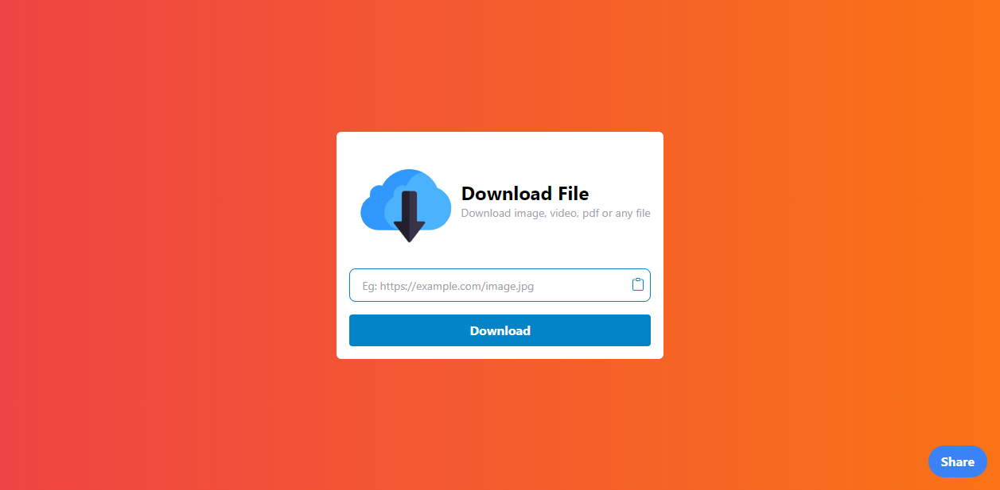

# React File Downloader App
A simple React File Downloader App using Vite, Tailwind CSS, and React.


## Usage
1. Clone this repository
```bash
git clone https://github.com/AbdurRaahimm/File-Downloader.git
```
2. Run The Essential Dependency
```bash
npm install
```
3. Run `npm run dev` to start the development server
```bash
npm run dev
```
4. Run `npm run build` to build the project
```bash
npm run build
```

## Screenshots


## Live Demo
[Live Demo](https://files-downlooader.netlify.app)


## Tools
- React
- Vite
- Tailwind CSS
- ESLint
- Prettier
- web share API
- React Toastify


## Connect on Social Media
- [Twitter](https://twitter.com/AbdurRahim4G)
- [Instagram](https://www.instagram.com/abdurrahim4g/)
- [Facebook](https://www.facebook.com/Rahim72446)
- [LinkedIn](https://www.linkedin.com/in/abdur-rahim4g/)
- [YouTube](https://youtube.com/@AbdurRahimm)


